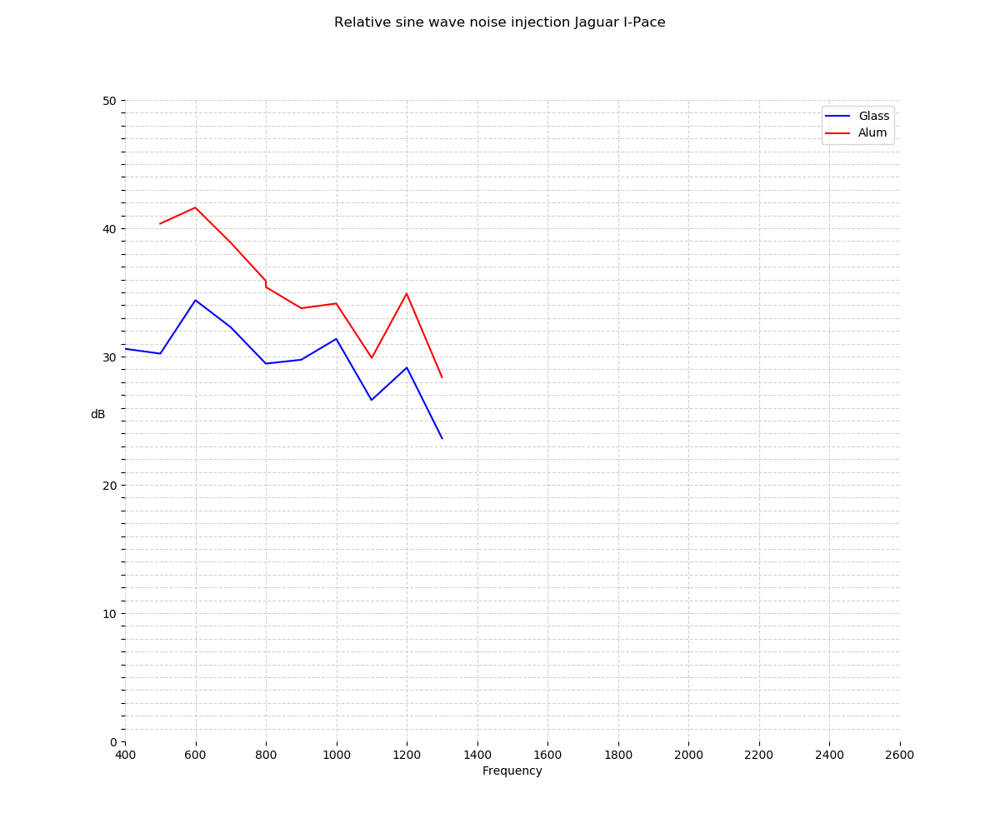
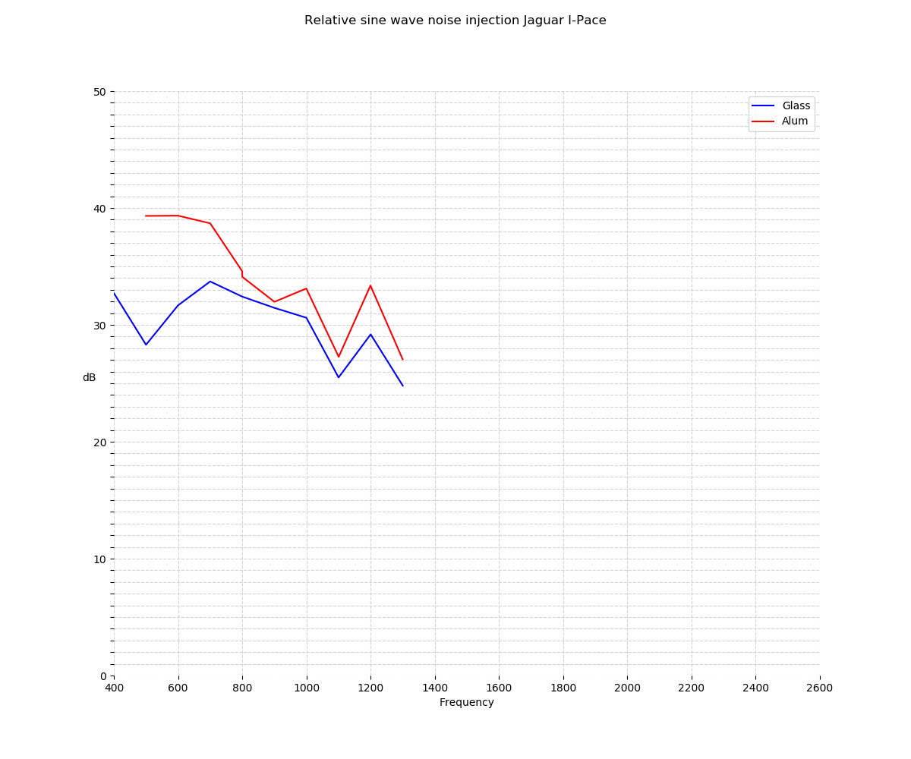
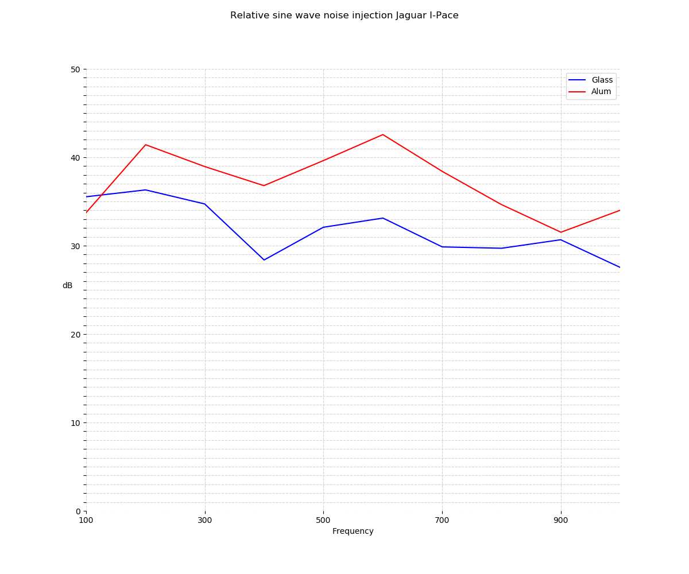
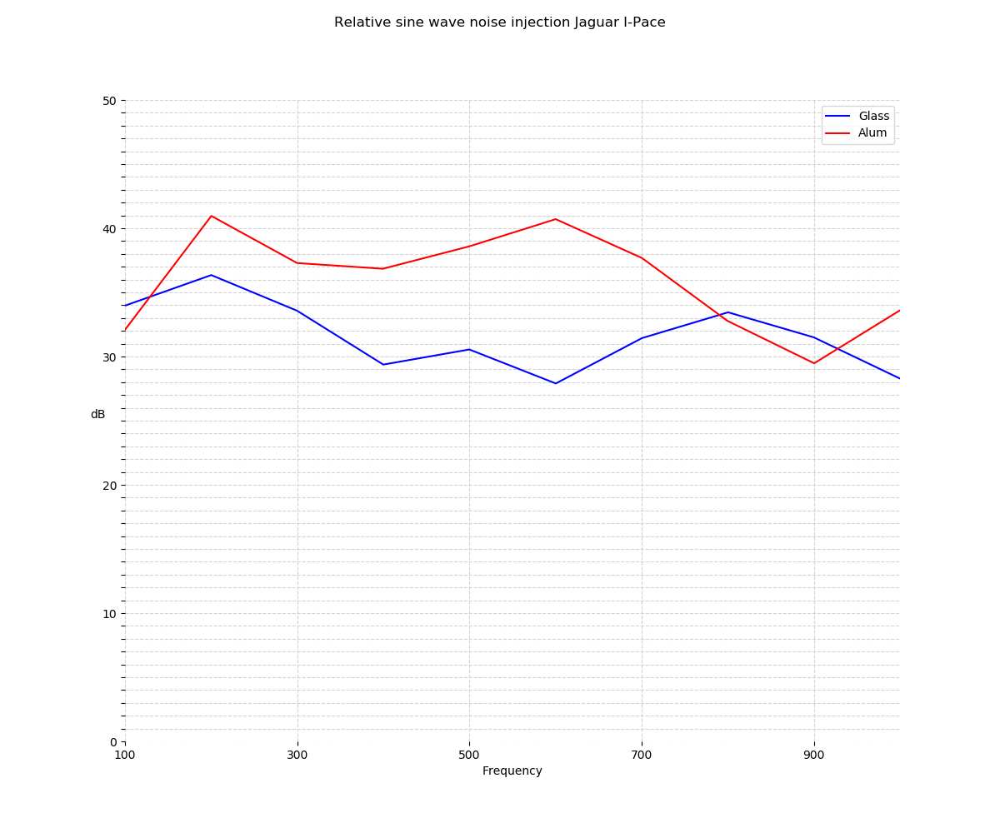

#  Measurements of noise suppression in Jaguar IPace

##  Introduction

The Jaguar IPace is a **very** quiet and stable car, due to its electrical engines and a very good overall construction.  That is all fine, but also means that you notice sound more easily.

On the different fora for Jaguar owners there have been reports on suspicious noise injection, with a theory that the roof may have something to do with this.

The noise in a Jaguar IPace seems to be dependent upon whether you have a glass roof or a hard roof.  The effect is most easily noticed when driving in tunnels.

Einar Sjaavik took an initiative to start measuring these things, and since we have nearly identical cars, and we both are very interested in measurement technology, we decided to give this a run.  Our cars just differ on what roof we have :-).

  

## Live measurements : Take 1

The first run we did we measured live in a tunnel.  The tunnel had traffic in both directions, so we didn't get results that where absolutely stable.  
What we did notice though was that the glass roof seemed about 6dB more quiet than the hard roof.

## Live measurements : Take 2

A month later we did the same again, but now in a tunnel with seperate tubes for each direction.  We got very stable results, and they were absolutely equal (!).  It baffled us at first, but then we realized that during Take 1 the weather was dry, whereas now the weather was **very** wet. The noise spectre seemed to be stronger in the higher frequencies.  

## Indoor measurements

We then brought the cars indoors where we had a sound rig where we could inject whatever sound we wanted.  It was raised above the roof of the cars and we did a series of measurements.

We used a stereo [Zoom H5 Digital recorder](https://www.komplett.no/product/1009351/datautstyr/rekvisita/kontorutstyr/avskrivere-og-diktatsystemer/zoom-h5-digitalopptake).

The mics were oriented forward/rear, where the forward pointing mic is Channel 1 below, and the rear pointing mic is Channel 2.

## Results from indoor measuremennts

### Results from first set of measurements, where we measure from 500 Hz to 3 kHz

Note:  Have only the data in for up to 1.5 kHz

Channel 1:

Channel 2:

### Results from second set of measurements, where we measure from 100 Hz to 1 kHz

Channel 1:

Channel 2:

